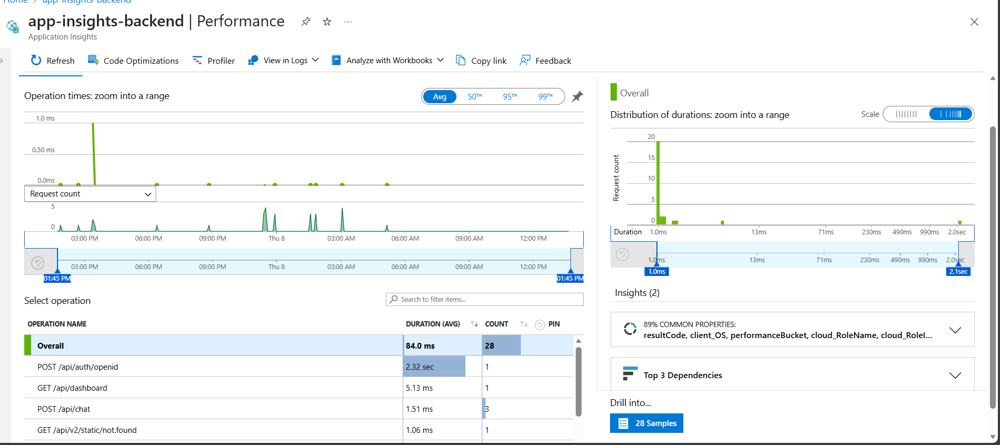
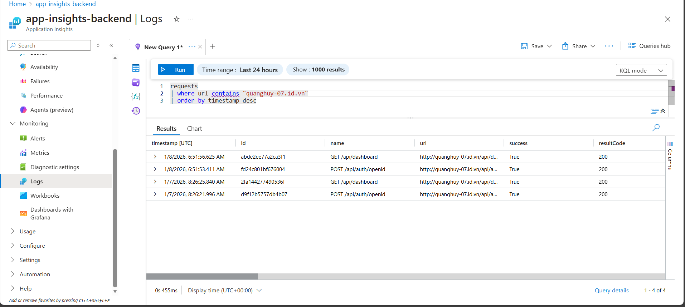
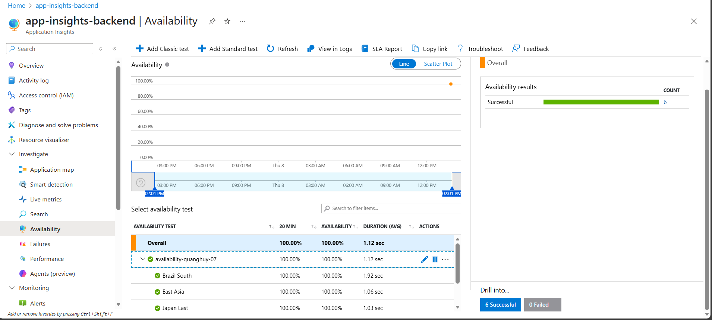
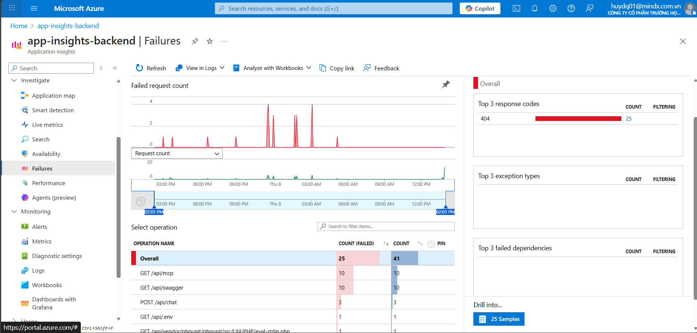
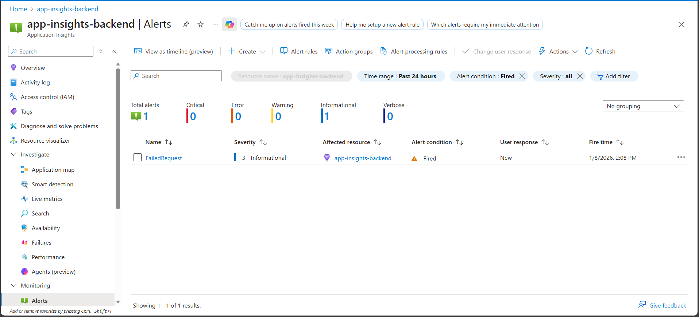
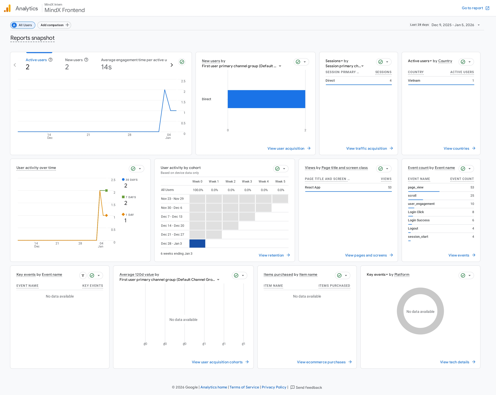
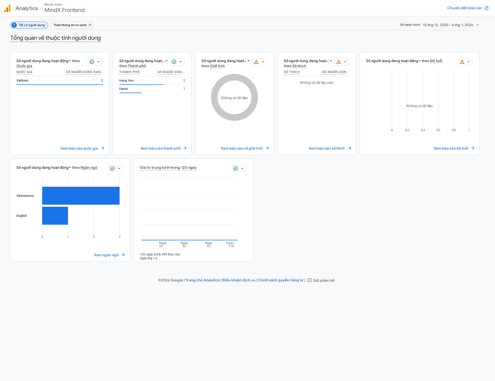
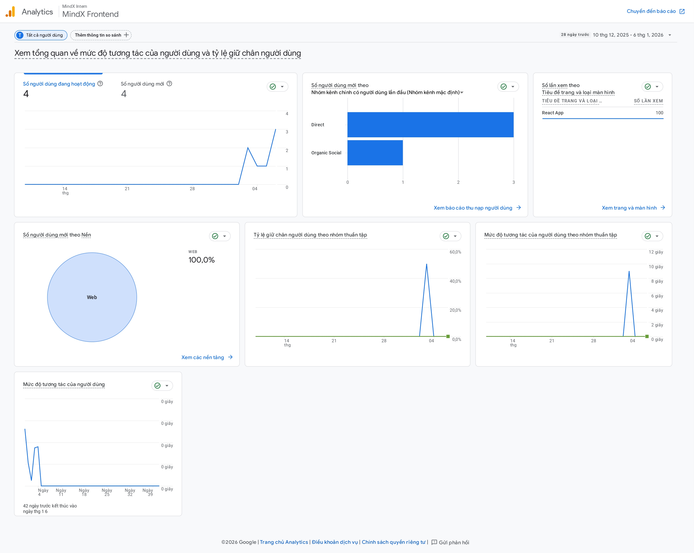
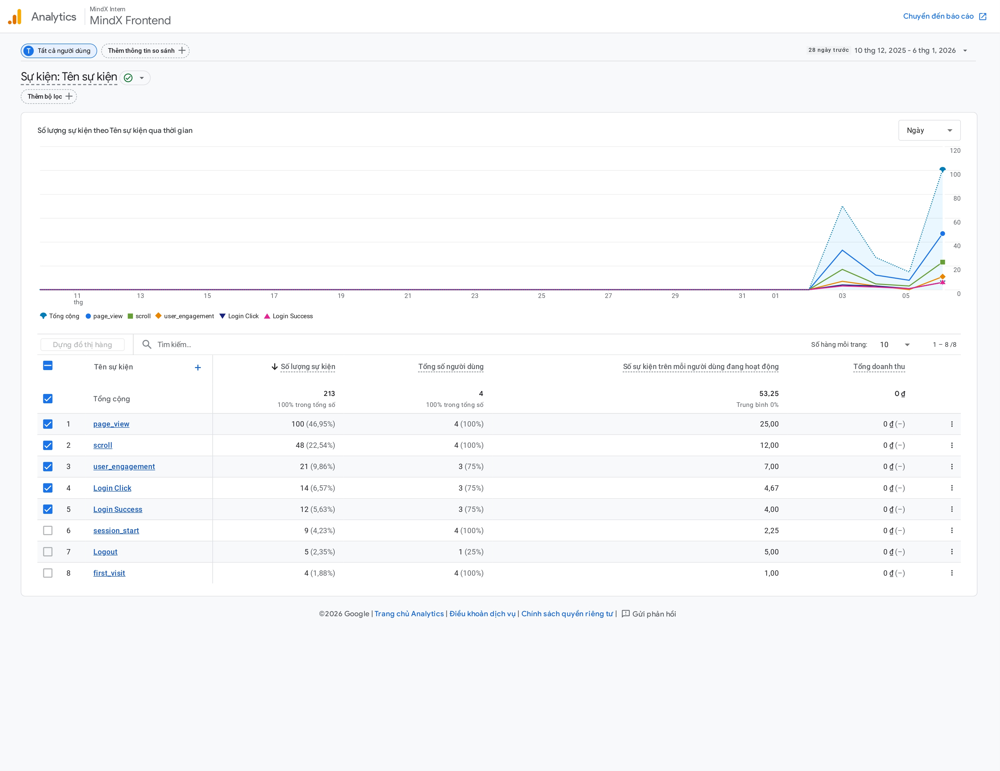

# Metrics Documentation

## Overview

This document describes how to **access** and **interpret** both **production metrics** and **product metrics** for the application.  
The goal is to help developers and stakeholders monitor system health, performance, and user behavior effectively.

---

## 1. Production Metrics (Azure Application Insights)

### 1.1 How to Access Production Metrics

1. Go to **Azure Portal**
2. Select the correct **Resource Group**
3. Open **Application Insights**
4. Use the following sections:
   - **Failures**
   - **Performance**
   - **Logs**
   - **Availability**

---

### 1.2 Key Production Metrics & Interpretation

#### HTTP Status Codes
| Status Code | Meaning | Interpretation |
|------------|--------|---------------|
| 200 | OK | Request processed successfully |
| 304 | Not Modified | Cache hit, not an error |
| 404 | Not Found | Invalid route or missing resource (alert configured) |
| 5xx | Server Error | Backend failure, critical issue |

#### Performance Metrics
- **Response Time**
  - < 500ms → Healthy
  - 500ms – 2s → Acceptable
  - > 2s → Performance issue
- **Dependency Duration**
  - High values may indicate database or external service issues

#### Errors & Logs
- **Exceptions** indicate unhandled errors in backend logic
- **Trace logs** help debug request flows
- **Custom logs** can be queried using KQL

---

### 1.3 Alerts Configuration
-A metric-based alert rule is configured to monitor failed HTTP requests.
-The alert triggers when the number of failed requests exceeds five within a defined evaluation window.
-The condition monitors a single time series and has an estimated monthly cost of $0.10.

#### Testing Server Error (HTTP 500)

To verify the alert configuration for server-side errors, a test endpoint is exposed:

- **Endpoint:** `/api/test-error`
- **Method:** GET
- **Behavior:** The endpoint intentionally throws an exception and returns an HTTP 500 response.
These alerts help detect incidents early and reduce downtime.

### 1.4 Access Permissions

- Azure Application Insights access is granted via Azure RBAC.
- Users are assigned the **Monitoring Reader** role to view logs, metrics, and alerts.
---

### 1.5 Application Insight Report Links And Image (Reference)
- Application Insights Resource:
https://portal.azure.com/#@mindx.com.vn/resource/subscriptions/f244cdf7-5150-4b10-b3f2-d4bff23c5f45/resourceGroups/mindx-intern-07-rg/providers/microsoft.insights/components/app-insights-backend/overview

- Application Insights – Performance (Screenshot):

- Application Insights – Logs (Screenshot):

- Application Insights – Avaibility (Screenshot):

- Application Insights – Failure (Screenshot):

- Application Insights – Alert (Screenshot):

## 2. Product Metrics (Google Analytics – GA4)

### 2.1 How to Access Product Metrics

1. Go to **Google Analytics**
2. Select the correct **GA4 Property**
3. Navigate to:
   - **Realtime**
   - **Engagement**
   - **Events**
   - **Conversions**

---

### 2.2 Key Product Metrics & Interpretation

#### User Metrics
- **Active Users**
  - Indicates real user traffic
- **New vs Returning Users**
  - Measures user retention

#### Engagement Metrics
- **Engagement Rate**
  - High → users find value
  - Low → UX or content issue
- **Average Engagement Time**
  - Indicates how long users stay on the app

#### Event Metrics
- **Key Events**
  - Login Click
  - Login Success
  - Logout
- Used to analyze user behavior flow

---

### 2.3 Access Permissions
- Google Analytics access is granted at the property level with **Viewer** or **Analyst** permissions.

### 2.4 GA4 Report Links And Image (Reference)
- GA4 Property:  
https://analytics.google.com/analytics/web/?authuser=0#/a379191558p518235486/reports/reportinghub

- GA4 Overview Report (Screenshot):

- GA4 User Metrics (Screenshot):

- GA4 Engagement Metrics (Screenshot):

- GA4 Event Metrics (Screenshot):

## 3. Summary

- **Production Metrics** focus on system stability, performance, and errors
- **Product Metrics** focus on user behavior and business value
- Both metrics together provide a complete view of application health

This documentation ensures that all team members can easily access and correctly interpret application metrics.
